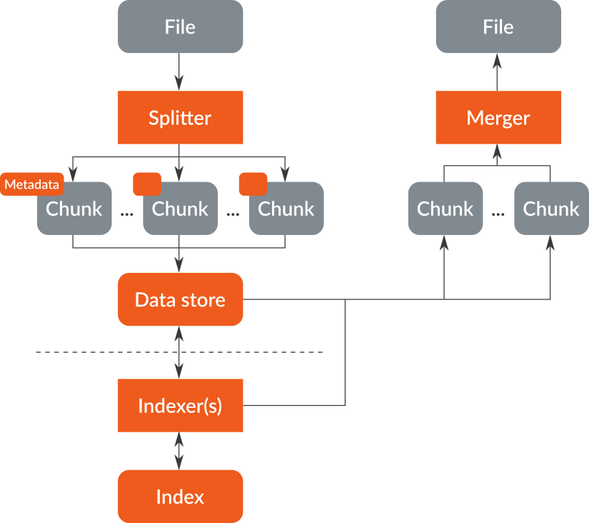
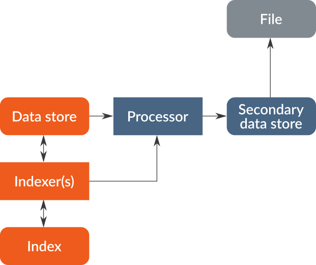

= GeoRocket User Documentation
Michel Krämer <michel.kraemer@igd.fraunhofer.de>
v1.0.0-SNAPSHOT
:toc: right
:homepage: http://georocket.io
:numbered:
:docinfo1:
:icons: font
:source-highlighter: highlight.js
 
Copyright (C) 2015-2016 Fraunhofer Institute for Computer Graphics Research IGD

== Introduction

GeoRocket is a high-performance data store for geospatial files. It can store 3D city models (e.g. CityGML), GML files or any other XML-based geospatial data sets. GeoRocket provides the following features:

* High performance data storage with multiple backends such as Amazon S3, MongoDB, distributed file systems (e.g. HDFS or Ceph), or your local hard drive (enabled by default)
* Support for high-speed search features based on the popular Open-Source framework https://www.elastic.co/[Elasticsearch]. You can perform spatial queries and search for attributes, layers and tags.
* GeoRocket ist made for the Cloud. Based on the Open-Source toolkit http://vertx.io[Vert.x] it is reactive and can handle big files and a large number of parallel requests.
* GeoRocket is Open-Source

=== Architecture

TODO





== Getting started

GeoRocket consists of two components: the server and the command-line interface (CLI). Download the _Server_ and _CLI_ bundles from the GeoRocket website and extract them to a directory of your choice.

Open your command prompt and change to the directory where you installed GeoRocket Server. Execute `georocketd` to run the server.

  cd georocket-server-1.0.0-SNAPSHOT/bin
  ./georocketd

Please wait a couple of seconds until you see the following message:

  GeoRocket launched successfully.

The has launched and now waits for incoming HTTP requests on port `63020` (default).

Next open another command prompt and change to the directory where you installed GeoRocket CLI. Run `georocket-cli` to access the server through a convenient command-line application.

  cd georocket-cli-1.0.0-SNAPSHOT/bin
  ./georocket-cli

You can now import your first geospatial file. Suppose your file is called `/home/user/my_file.gml`. Issue the following command to import it to GeoRocket.

  ./georocket-cli import /home/user/my_file.gml

GeoRocket CLI will now send the file to the server. Depending on the size of the dataset this will take a couple of seconds up to a few minutes (for very large datasets).

Finally, export the contents of the whole store to a file using the `export` command.

  ./georocket-cli export / > my_new_file.gml

TIP: You can also search for individual features (chunks) and export only a part of the previously imported file. Refer to the <<search-command>> section.

That's it! You have successfully imported your first file into GeoRocket.

== Command-line application

GeoRocket comes with a handy command-line interface (CLI) letting you interact with the server in a convenient way on your command prompt. The interface provides a number of commands. The following sections describe each command and their parameters in detail.

[NOTE]
====
In the following sections it is assumed that you have the `georocket-cli` executable in your path. If you have not done so already, you may add it to your path with the following command (Linux):

  export PATH=/path/to/georocket-cli-1.0.0-SNAPSHOT/bin:$PATH

Or under Windows do:

  set PATH=C:\path\to\georocket-cli-1.0.0-SNAPSHOT\bin;%PATH%
====

=== Help command

Display help for the command-line interface and exit.

Examples:

  georocket-cli

or

  georocket-cli --help

or

  georocket-cli help

The help command also gives information on specific CLI commands. Just provide the name of the command you would like to have help for. For example, the following command displays help for the <<import-command>>:

  georocket-cli help import

[[import-command]]
=== Import command

Import one or more files into GeoRocket. Specify the name of the file to import as follows.

  georocket-cli import myfile.xml

You can also import the file to a certain layer. The layer will automatically be created for you. The following command imports the file `myfile.xml` to the layer `CityModel`.

  georocket-cli import --layer CityModel myfile.xml

Use slashes to import to sub-layers.

  georocket-cli import --layer CityModel/LOD1/Center myfile.xml

You may attach tags to imported files. Tags are human-readable labels that you can use to search for files or chunks stored in GeoRocket. Use a comma to separate multiple tags.

  georocket-cli import --tags city,district,lod1 myfile.xml

=== Export command

Export a layer stored in GeoRocket. Provide the name of the layer you want to export.

  georocket-cli export CityModel/LOD1

By default the export command writes to standard out (your console). Redirect output to a file as follows.

  georocket-cli export CityModel/LOD1 > lod1.xml

You may also export the whole data store. Just provide the root layer `/` to the export command.

  georocket-cli export /

WARNING: Exporting the whole data store may take a while depending on how much data you have stored in GeoRocket.

[[search-command]]
=== Search command

Search the GeoRocket data store and export individual geospatial features (chunks). Provide a <<query-language, query>> to the search command as follows.

  georocket-cli search myquery

You can also search individual layers.

  georocket-cli search --layer CityModel myquery

By default the search command writes to standard out (your console). Redirect output to a file as follows.

  georocket-cli search myquery > results.xml

Use a space character to separate multiple query terms. Search results will be combined by logical OR.

See the <<query-language>> section for a full description of all possible terms in a query.

=== Delete command

Remove geospatial features (chunks) or whole layers from the GeoRocket data store. Provide a <<query-language, query>> to the delete command to select the features to delete.

  georocket-cli delete myquery

You can also restrict the delete command to a certain layer.

  georocket-cli delete --layer CityModel myquery

Delete a whole layer (including all its chunks and sub-layers) as follows.

  georocket-cli delete --layer CityModel/LOD1

You may even delete the whole data store by specifying the root layer `/`.

  georocket-cli delete --layer /

CAUTION: This is a dangerous operation. It will remove everything that is stored in your GeoRocket instance. There is no safety net--no confirmation prompt and no recycle bin.

== HTTP interface

GeoRocket Server provides an (REST-like) HTTP interface that you can use to interact with the data store as well as to embed GeoRocket in your application.

=== GET file

Search the data store for chunks that match a given <<query-language, query>>. Merge the chunks found and return the result as a file.

===== Resource URL

  /store/:path

===== Parameters

[cols="1,2"]
|===
| *path* +
  _(required)_
| The absolute path to a layer to search. Use the root layer `/` to query the whole data store.
| *search* +
  _(optional)_
| An URL-encoded <<query-language, query string>>. If no query string is provided all chunks from the requested layer will be returned.
|===

===== Example request

  GET /store/CityModel?search=LOD1+textured+13.378,52.515,13.380,52.517

===== Example response

```
<?xml version="1.0" encoding="UTF-8" standalone="yes"?>
<CityModel ...>
  ...
</CityModel>
```

=== POST file

TODO

=== DELETE chunks

TODO

=== DELETE layer

TODO

[[query-language]]
== Query language

NOTE: As of version 1.0.0-SNAPSHOT the query language is rather limited. At the moment you can only specify strings and bounding boxes.

=== Strings

GeoRocket performs a full-text search for strings in every tag and every indexed attribute.

Example:

  string

=== Bounding boxes

Bounding boxes can be specified using four floating point numbers separated by a comma. The format is:

  left,bottom,right,top

or

  minimum longitude, minimum latitude, maximum longitude, maximum latitude

NOTE: As of version 1.0.0-SNAPSHOT GeoRocket only supports spatial queries given in WGS84 coordinates (longitude/latitude). However, data stored in GeoRocket can have an arbitrary spatial reference system as long as it is specified in the original file.

Example:

  13.378,52.515,13.380,52.517

=== Logical OR

By default all terms in a query are combined by logical OR. Use a space character to separate multiple terms.

Example:

  string1 string2 13.378,52.515,13.380,52.517 string3

== Advanced topics

=== Configuration

* File backend
* Amazon S3
* MongoDB
